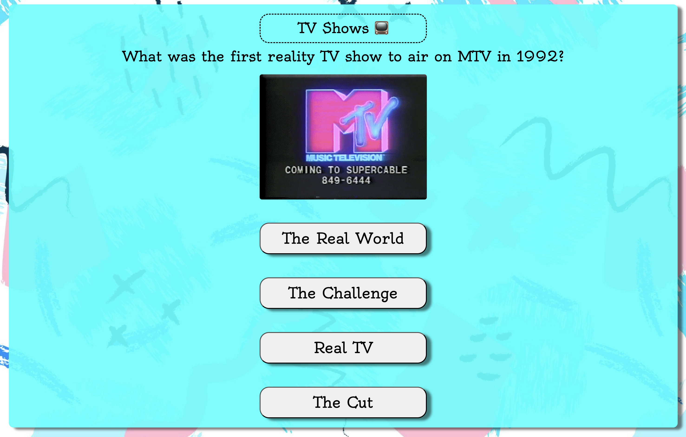
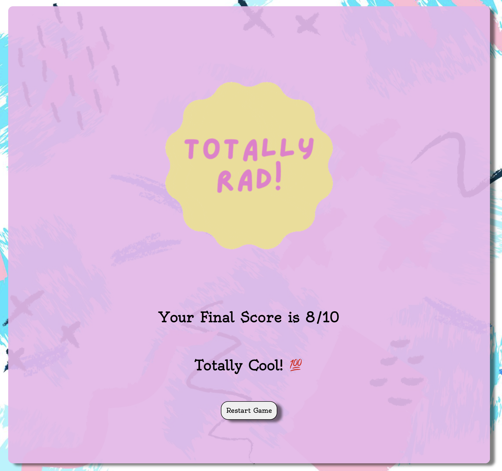

# 90's / 2000s Trivia Time! 🥳 🎉

Welcome to 90's / 2000s Trivia Time. A 10 question trivia game that test your knowledge on categories such as movies, music, games, and tv shows from the 90's and early 2000s. Click start and let's see if you can score a 10/10!

# How to Play 🎮

The rules are simple!

1. Click **Start Game** to begin
2. Read through each question and select what you believe is the correct answer.
   > Warning‼️ You only have one shot to select your choice before the quiz moves on to the next question! **CHOOSE WISELY 👀**
3. At the end of the game, you will recieve your score out of 10, along with a custom message based on your score!
4. Think you can get a higher score? Click **Restart Game** to play again! 🔁

# Game Preview 📸

# Tech Used 💻

- HTML5
- CSS3
- JavaScript

# Upcoming Updates 🎉

- 💡 User will be able to select which category they want to play
- 🏆 Leaderboard
- ⏳ Speed round with timer!

# Attributions

- Sound Effect by <a href="https://pixabay.com/users/freesound_community-46691455/?utm_source=link-attribution&utm_medium=referral&utm_campaign=music&utm_content=6416">freesound_community</a> from <a href="https://pixabay.com/sound-effects//?utm_source=link-attribution&utm_medium=referral&utm_campaign=music&utm_content=6416">Pixabay</a>

- Sound Effect by <a href="https://pixabay.com/users/u_ss015dykrt-26759154/?utm_source=link-attribution&utm_medium=referral&utm_campaign=music&utm_content=146263">u_ss015dykrt</a> from <a href="https://pixabay.com/sound-effects//?utm_source=link-attribution&utm_medium=referral&utm_campaign=music&utm_content=146263">Pixabay</a>
  Sound Effect by u_ss015dykrt from Pixabay
